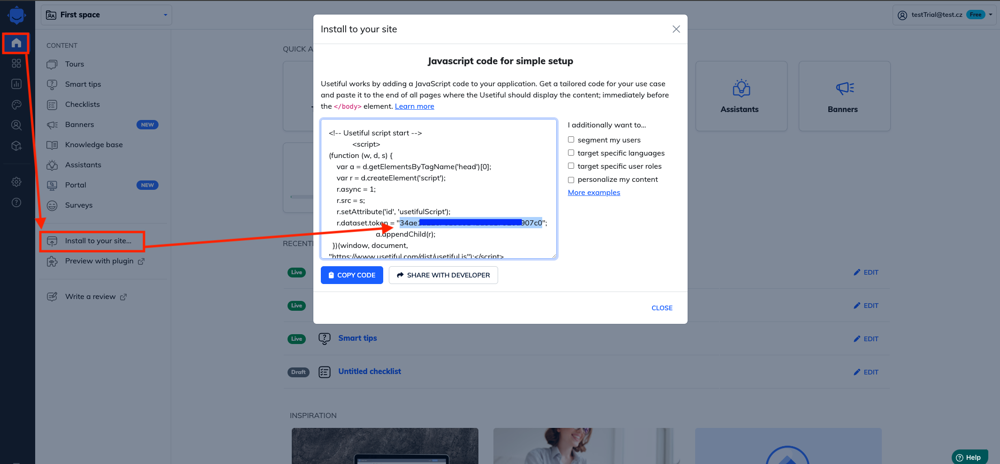
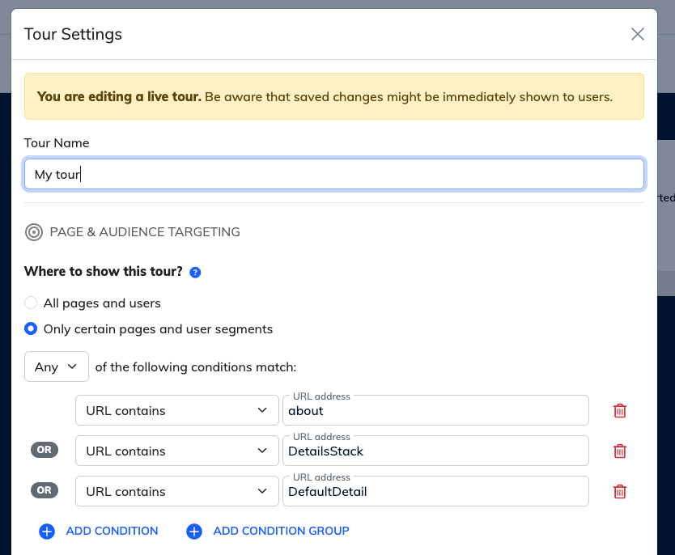

# usetiful-react-native

###Empower Your React Native Apps with Usetiful’s Seamless Onboarding and Product Guidance

The Usetiful React Native package brings the power of Usetiful’s user onboarding and engagement tools directly into React Native apps. Designed for those looking to enhance the user experience, Usetiful seamlessly integrates guided tours, including modals, slideouts, and pointers, as well as onboarding flows to help users navigate your app more efficiently.

## Installation

```sh
npm install usetiful-react-native
```

```sh
yarn add usetiful-react-native
```

## Usage

```js
import { Usetiful } from 'usetiful-react-native';
```

### Wrap Your App with the Usetiful Tag

Note: When using React Navigation, Usetiful must be a child of the NavigationContainer. For Expo projects, you can wrap your main _layout page with Usetiful.

```js
<NavigationContainer>
  <Usetiful token="YOUR_USETIFUL_TOKEN">
    <YourApp />
  </Usetiful>
</NavigationContainer>
```

## Getting Your Usetiful Token

To integrate Usetiful into your app, you’ll need to get your Usetiful Token. Follow these steps to obtain it:

	1.	Log in to your Usetiful account.
	2.	Navigate to Home --> Install to your site --> r.dataset.token.
	3.	Locate r.dataset.token and copy its value.



## Create a tour in Usetiful panel

To create a tour, log in to your Usetiful account and navigate to Home → Tour in the menu.

## Modals and Slide Outs
Slide-outs and modals are entirely codeless. Simply define them in the Usetiful panel, and they will automatically appear in your target app.

## Pointers

To use pointers, you need to register your element with our custom hook. You can choose any key for your Ref and register it using useRefRegister. Then, use your key as a selector in the Usetiful admin.

```js
useRefRegister(
  { key: 'Test1', ref: viewRef },
  { key: 'SecondView', ref: secondViewRef },
  { key: 'NextView', ref: nextViewRef }
);
```

Example:
```js
const viewRef = useRef < View > null;
const secondViewRef = useRef < View > null;
const nextViewRef = useRef < View > null;

useRefRegister(
  { key: 'Test1', ref: viewRef },
  { key: 'SecondView', ref: secondViewRef },
  { key: 'NextView', ref: nextViewRef }
);

return (
  <View>
    <View ref={viewRef}>
      <Text>First Pointer</Text>
    </View>
    <View ref={secondViewRef}>
      <Text>Second Pointer</Text>
    </View>
    <View ref={nextViewRef}>
      <Text>Third Pointer</Text>
    </View>
  </View>
);
```

## Targeting Screens

We support React Navigation version 6 and higher. To target a screen, add the screen name as the value in the URL contains condition.

Note: If your target screen is a child within a nested stack (default screen), you need to specify both the parent and child screen names. Separate them with “or” (as shown in the image) to account for different ways the screen might be navigated to.



## License

MIT

---

Made with [create-react-native-library](https://github.com/callstack/react-native-builder-bob)
